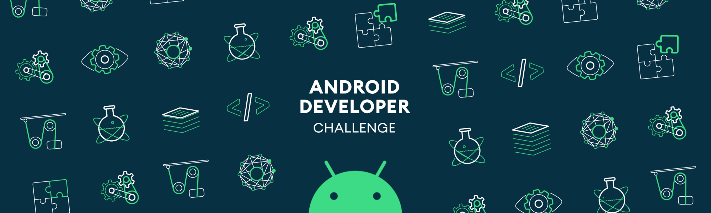

<h4 class="c19 c21">Tell us what your idea is.</h4>

* * *

<h3 class="c3">Describe in 250 words what the feature or service will do and how you’ll use Machine Learning to push the bar:  
</h3>

As a professional photographer my uncle spends around <em>eight to ten hours</em> in culling of 4000 photographs after every wedding shoot. The world is moving towards mobile cameras from DSLR. An <strong>on-device ML algorithm </strong> can automate the process to take down the time to 5 minutes or less <em>cutting down 99% </em>of the actual time spent in the process.  
With on device machine learning, the service will be able to classify images into blurry, out of focus, overexposed, underexposed, duplicates and best shots.  
This will provide a professional photographer with more time to grow his photography business, and also in the long run a platform to an amateur photographer to know what's good and what's bad photo looks like.  

Tell us how you plan on bringing it to life.

* * *

<h3 class="c6">Describe where your project is, how you could use Google’s help in the endeavor, and how you plan on using On-Device ML technology to bring the concept to life. The best submissions have a great idea combined with a concrete path of where you plan on going, which should include:</h3>

*   (1) any potential sample code you’ve already written,
*   (2) a list of the ways you could use Google’s help,
*   (3) as well as the timeline on how you plan on bringing it to life by May 1, 2020\.  
    

We are working on the primary market research of this concept from past 3-4 months and results are really convincing. For the prototype, we have used  Firebase Vision Edge to classify photos into blur and unblur and overexposed and underexposed with an accuracy of 80% and 85% respectively.  
With the help of Google and the best datasets, we are aiming to achieve a higher accuracy in our algorithms  along with a possible integration of this in Google Photos.

With the help of AutoML and our proprietary algorithms, we have already created a Proof of concept.  

<strong>Timeline:</strong>  
<strong>December 2 - December 9 :</strong> Creating the user interface  
<strong>December 9 - December 15:</strong> Releasing Proof of Concept with blurry, out of focus and duplicates classification 
<strong>December 15 - December 22:</strong> Creating datasets, training models on Blinks, emotions, cropped and sharpness on Firebase Vision Edge

<strong>Dec 22- Dec 29:</strong> Testing Models and Evaluating Results  
<strong>Dec 29 - Jan 6 :</strong> Integrating New Models with User Interface  
<strong>Jan 6 - Jan 12:</strong> Testing the Integration and handing over to users  
<strong>Jan 12- Jan 19: </strong>Asking Feedback to reiterate  
<strong>Jan 19 - Jan 26:</strong>  Working on Iteration

<strong>Jan 26 - Feb 1:</strong> Working on Iteration  
<strong>Feb 1 - Feb 7:</strong> Releasing MVP  
<strong>Feb 7 - Feb 14:</strong> Work on Algorithm Accuracy  
<strong>Feb 14 - Feb 21:</strong> Testing and integrating better accuracy models  
<strong>Feb 21 - March 1:</strong> Customer Feedback  
<strong>March 1 - March 8 :</strong> Reiterating on Customer Feedback  
<strong>March 9 - March 16:</strong> Launch

<h4 class="c19 c21">Tell us about you.</h4>

* * *

 A great idea is just one part of the equation; we also want to learn a bit more about you. Share with us some of your other projects so we can get an idea of how we can assist you with your project.  

I am a Google Developer Expert for Web and Angular and an avid blogger. I have written some great codelabs on google codelabs along with some technical blogs on Tensorflow. While working with various technologies in the past like Google Cloud, Firebase, NodeJS, Angular, Nativescript etc, I can learn any technology easily.  
Projects that I have worked on:

1.  [Open-event-wsgen](https://www.google.com/url?q=https://github.com/fossasia/open-event-wsgen&sa=D&ust=1575291485564000) : A platform to generate websites automatically for events, meetups, and conferences.
2.  [Roobits](https://www.google.com/url?q=https://roobits.com/&sa=D&ust=1575291485565000): An GCP infrastructure to collect and analyse data in real-time.
3.  [Motley](https://www.google.com/url?q=https://github.com/coding-blocks/motley&sa=D&ust=1575291485565000): A UI framework to follow the ITCSS design language
4.  [Eye-bot](https://www.google.com/url?q=https://github.com/aayusharora/eye-bot&sa=D&ust=1575291485566000)[:](https://www.google.com/url?q=https://github.com/aayusharora/eye-bot&sa=D&ust=1575291485566000) A R-PI based IOT device control the prosthetic on eye blinks.

  

Next steps.  

* * *

 

*   Be sure to include this cover letter in your GitHub repository
*   Your GitHub repository should be tagged #AndroidDevChallenge
*   Don’t forget to include other items in your GitHub repository to help us evaluate your submission; you can include prior projects you've worked on, sample code you've already built for this project, or anything else you think could be helpful in evaluating your concept and your ability to build it
*   [The final step is to fill out this form to officially submit your proposal.](https://www.google.com/url?q=https://docs.google.com/forms/d/e/1FAIpQLSe43koQL33IzgxXQl29Ex3AhFuqd4hQzxLiXREqwRkDGtx1vA/viewform?usp%3Dsf_link&sa=D&ust=1575291485568000)

