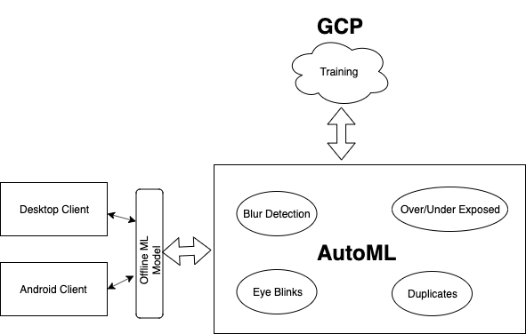
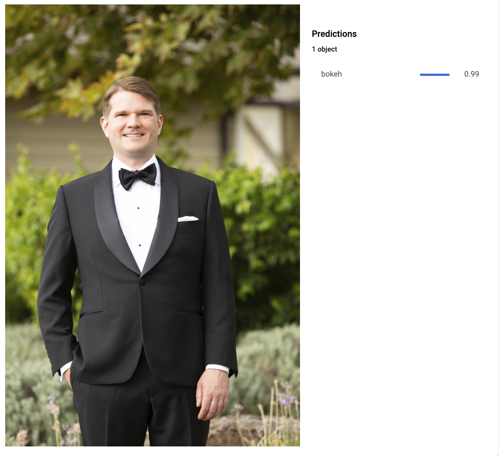
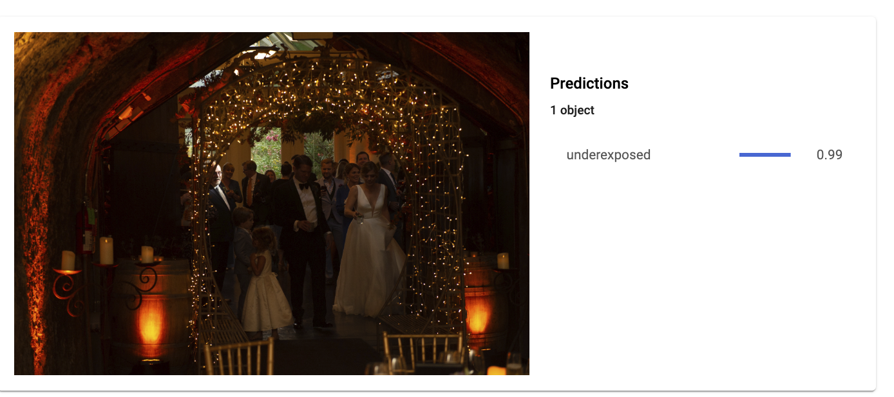

  

## Origin 
My uncle is a wedding photographer. Getting 200 best photos for the album out of 4000 photos after each wedding is 1-2 days frustrating process for him. With technology, filtering the same amount of technically bad photos is feasible in lesser than 5 minutes. Like my uncle, there are 7 Billion photographers on the planet who can cut down 99% of their time with Aftershoot.
We want to start with photographers but want to scale it to general audience so that they can get their best photos using Mobile camera. 

## How do we envision this?
Solving the problem for a professional photographer is just a step towards our vision. Our final vision is to give this app to every person on this planet to gather his best shots filtering out all blurry, out of focus, overexposed, underexposed and duplicates.

## How is the progress so far?
We have spent a great amount of time last quarter to analyse the extent of the problem. In the last month, we have successfully developed a Proof of Concept to classify blurry, bokeh and unblurry images. We have extensively use Cloud AutoMl to achieve this. 

- Desktop Application [ Professionals ]
  - [x] POC 
  - [x] MVP

- Android Application [ Amateurs, Hobbyists ] 
  - [x] POC 
  - [ ] MVP 

#### Architecture

Please have a look at our POC.
POC - Electron Desktop App for Professionals 
https://drive.google.com/file/d/1tt2JZPNd1QyShZr9fxt7YF9SxoIxByCO/view

Snapshots [ Android POC for Hobbyists and Amateurs ]

  

And also some AutoML exciting results :D

| Feature       | Status        |Accuracy|
| ------------- |:-------------:| -----:|
| Blur          | Done          | 81%   |
| Exposure      | Done          | 82%   |
| Blinks        | In Progress   |       |
| Duplicates    | In Progress   |       |
| ...           | In Progress   |       |

### AutoML Results:
<h4>Blur Detection Results:</h4>

Bokeh

Blurry

<h4>Exposure Detection</h4>

UnderExposed

#AndroidDevChallenge

<a href='https://github.com/aayusharora/Aftershoot/blob/master/cover-letter.md'>Cover Letter</a>
